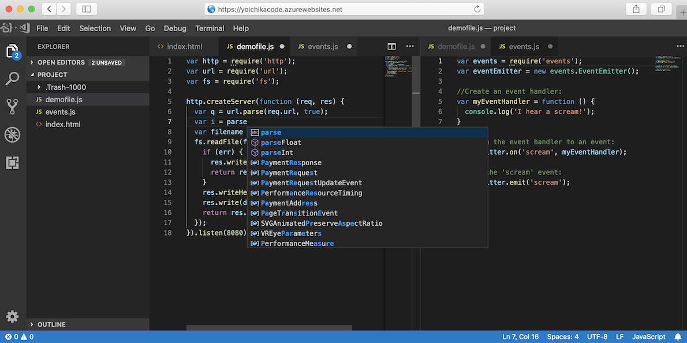

# Visual Studio Code Server for Azure Webapp

The aim of this repository is to deploy [code-server](https://github.com/codercom/code-server), VS Code running on a remote server, to [Azure Webapp for Containers](https://azure.microsoft.com/en-us/services/app-service/containers/).

> [WARNING] Code Server is unrealistically slow on Azure Webapp for Containers 



## Run in Docker

```sh
docker run -it -p 127.0.0.1:8443:8443 -v "${PWD}:/home/coder/project" codercom/code-server:1.621 --allow-http --no-auth
```

## Deploy Code Server to Azure Webapp for Containers

Prepare docker compose YAML file for code server webapp (`codeserver.yaml`)
```sh
cat << EOD | tee codeserver.yaml
version: '3.3'

services:
  codeserver:
    image: 'codercom/code-server:1.621'
    volumes:
     - ${WEBAPP_STORAGE_HOME}/site/wwwroot:/home/coder/project
    ports:
      - "80:8443"
    entrypoint:
      - dumb-init
      - code-server
      - --allow-http
      - --no-auth
    restart: always
EOD
```

Open `deploy.sh`and add values for `RESOURCE_GROUP`, `REGION`, `APP_NAME` and `APP_PLAN_NAME`, then run the script to deploy the code server container to Azure Webapp for Containers.

> deploy.sh
```bash
RESOURCE_GROUP="<RESOURCE GROUP>"
REGION="<REGION: japaneast>"
APP_NAME="<APP SERVICE NAME>"
APP_PLAN_NAME="<APP SERVICE PLAN NAME>"
CONFIG_FILE="codeserver.yaml"

cwd=`dirname "$0"`
expr "$0" : "/.*" > /dev/null || cwd=`(cd "$cwd" && pwd)`

echo "Create Resource Group: $RESOURCE_GROUP"
az group create --name $RESOURCE_GROUP --location $REGION

echo "Create App Service Plan: $APP_PLAN_NAME"
az appservice plan create \
  --name $APP_PLAN_NAME \
  --resource-group $RESOURCE_GROUP \
  --sku S1 --is-linux

echo "Create Web App for Container: $APP_NAME"
az webapp create \
  --resource-group $RESOURCE_GROUP \
  --plan $APP_PLAN_NAME \
  --name $APP_NAME \
  --multicontainer-config-type compose \
  --multicontainer-config-file $cwd/$CONFIG_FILE

echo "Add App Setting"
az webapp config appsettings set \
  --resource-group $RESOURCE_GROUP \
  --name $APP_NAME \
  --settings WEBSITES_ENABLE_APP_SERVICE_STORAGE=TRUE
```

Access the code-server on Azure webapp
```sh
open https://$APP_NAME.azurewebsites.net
```

## Cleanup 

> cleanup.sh
```
az group delete --name $RESOURCE_GROUP
```